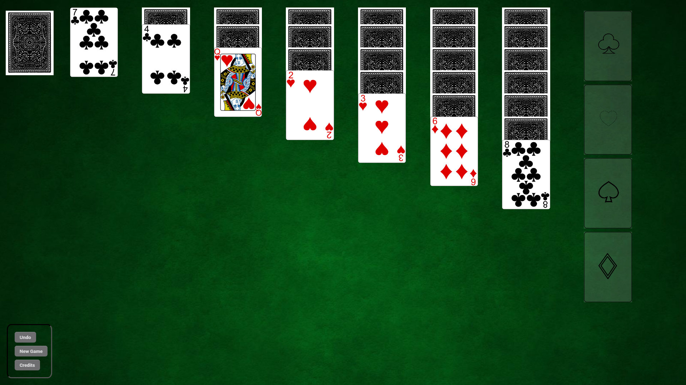

# Solitaire Game

This is a simple implementation of the classic Solitaire card game using HTML, CSS, and JavaScript.

## Table of Contents

- [Description](#description)
- [How to Play](#how-to-play)
- [Prerequisites](#prerequisites)
- [Installation](#installation)
- [Usage](#usage)
- [Customization](#customization)
- [Contributing](#contributing)
- [License](#license)

## Description

This project is a web-based Solitaire card game. It features a user interface built with HTML and CSS, and the game logic is implemented in JavaScript. The project includes features like moving cards, shuffling the deck, and following the standard rules of Solitaire.

## How to Play

### How to Play Solitaire

Solitaire, also known as "Patience," is a popular single-player card game. The most common version is "Klondike" Solitaire. Here's how you play:

#### Setup
1. **Deck:** Use a standard 52-card deck.
2. **Tableau:** Deal seven piles of cards. The first pile has one card, the second has two, the third has three, and so on, up to the seventh pile, which has seven cards. Only the top card of each pile is face-up; the rest are face-down.
3. **Foundations:** Four empty spaces for each suit (hearts, diamonds, clubs, spades) to be built from Ace to King.
4. **Stock:** The remaining cards form the stock pile.
5. **Waste:** Cards that cannot be played immediately are placed face-up in the waste pile.

#### Objective
- Move all the cards to the four foundation piles, sorted by suit and in ascending order from Ace to King.

#### Rules
1. **Building on the Tableau:**
   - Cards can be moved from one tableau pile to another in descending order and alternating colors (e.g., a red 9 can be placed on a black 10).
   - Only a King can be moved to an empty tableau space.
   - You can move sequences of cards as a unit (e.g., a red 7, black 6, red 5) if the sequence is in descending order and alternating colors.

2. **Exposing Hidden Cards:**
   - When you move a face-up card, you can turn over the face-down card beneath it.

3. **Moving Cards to Foundations:**
   - Cards are moved to the foundation piles in ascending order by suit (Ace to King).
   - Only an Ace can be placed on an empty foundation pile.

4. **Using the Stock:**
   - Draw cards from the stock pile one at a time or three at a time, depending on your chosen rules.
   - Cards from the stock that cannot be played immediately are placed in the waste pile.
   - You can go through the stock pile as many times as you like, depending on your chosen rules.

5. **Winning the Game:**
   - You win by moving all cards to the foundation piles.

#### Tips
- Focus on exposing hidden cards in the tableau.
- Move cards to the foundations only when it benefits you (i.e., don’t move a card if it prevents you from making a necessary move in the tableau).
- Try to create empty tableau spaces to move Kings into.

## Prerequisites

Make sure you have the following software installed:

- Web browser (Chrome, Firefox, etc.)

## Installation

1. Clone or download this repository.
2. Open the `main.html` file in your web browser.

## Usage

- Click the cards to move them, unable to drag and drop.
- Follow the standard Solitaire rules to arrange the cards.

## Customization

You can customize the game's appearance and rules by modifying the provided HTML, CSS, and JavaScript files.

### Customizing CSS

You can modify the game's appearance by editing the `style.css` file. You can change colors, fonts, or layout to suit your preferences.

### Customizing JavaScript

The game's logic is implemented in `main.js`. You can make changes to the rules or add additional features to the game by editing this file.

## Contributing

Feel free to contribute to this project by opening issues or creating pull requests. Your contributions are welcome!

## License

This project is licensed under the MIT License - see the [LICENSE.md](LICENSE.md) file for details.